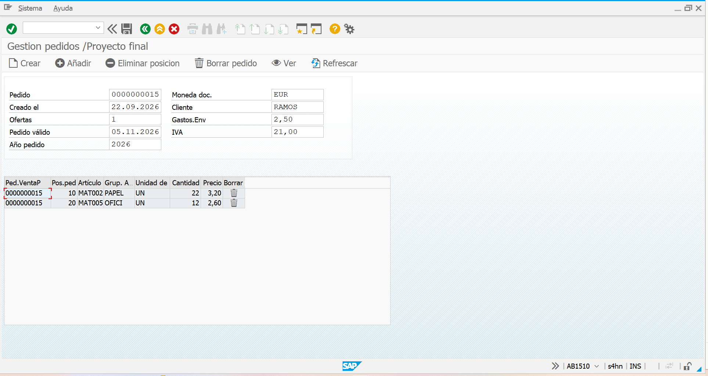
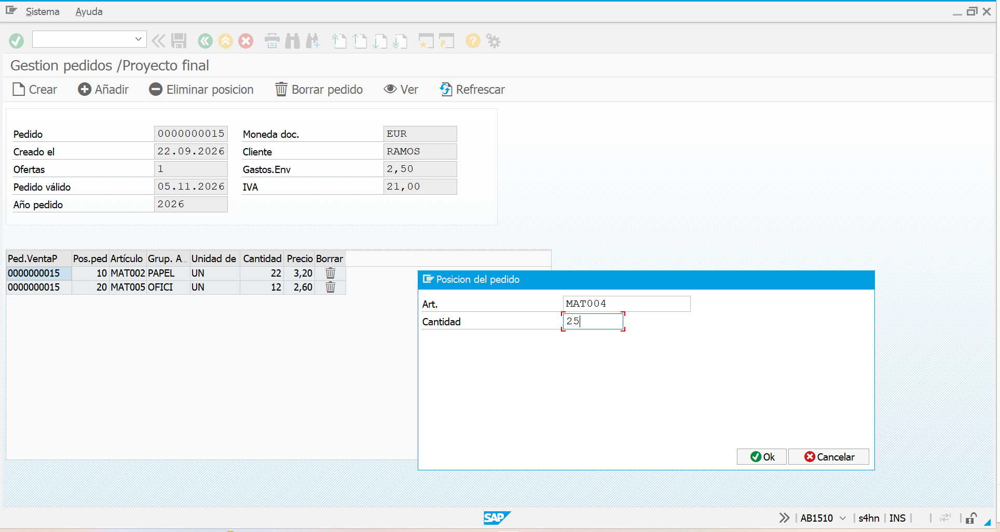
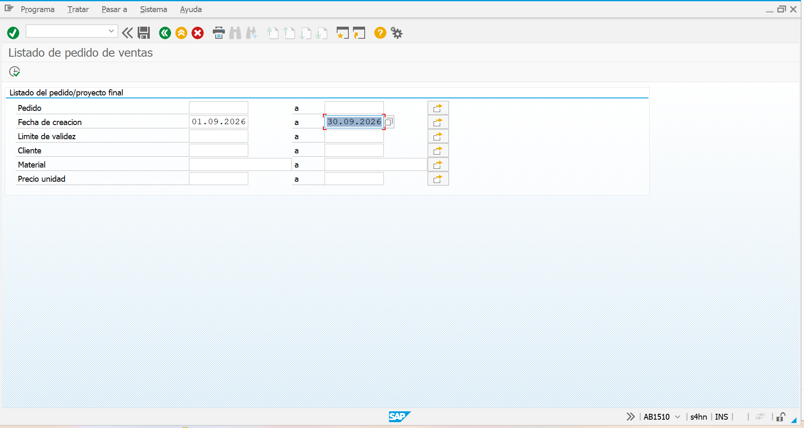
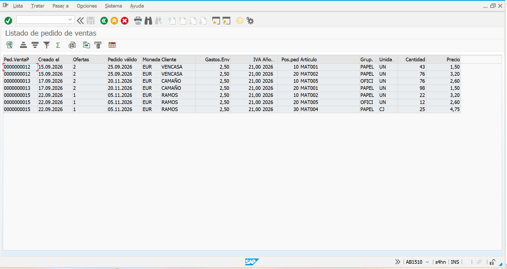
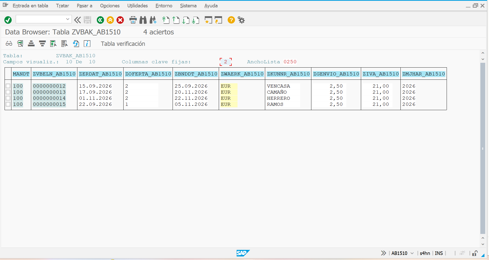

# sap-abap-gestion-pedidos
Sistema gestor de pedidos de ventas en SAP ABAP: dynpros, ABAP OO, ALV y rangos numéricos
# Sistema Gestor de Pedidos de Ventas — SAP ABAP

Proyecto final del programa **SAP Full Stack**. Aplicación ABAP para gestionar pedidos de ventas en un almacén pequeño: alta de pedidos con numeración automática, posiciones con precios tomados del maestro de materiales, grabación en base de datos y un listado ALV con filtros.



## Funcionalidades

**Transacción de gestión (`ZGESTION_PED_AB1510`)**

- Crear pedidos con número asignado automáticamente por un rango numérico (SNRO).
- Añadir posiciones eligiendo el material: el precio, la unidad y el grupo se leen del maestro de materiales.
- Quitar posiciones desde una ventana o con doble clic en el ALV.
- Grabar, visualizar y borrar pedidos completos (cabecera y posiciones).

**Transacción de listado (`ZLISTADO_PED_AB1510`)**

- Pantalla de selección por pedido, fechas, cliente, material y precio.
- Listado ALV a nivel de posición, uniendo cabecera y posiciones con un `INNER JOIN`.

## Tecnologías y conceptos

| Área | Qué se usa |
|---|---|
| Diccionario ABAP | Tablas transparentes, elementos de datos, dominios, claves externas, ayuda de búsqueda, tipo de tabla, vista de actualización (SM30) |
| ABAP OO | Clase global `ZCL_PEDIDO_AB1510` con constructor y métodos; clase local para eventos del ALV |
| Dynpros | Pantalla principal y dos ventanas modales, módulos PBO/PAI, status GUI y Custom Control |
| ALV | `CL_SALV_TABLE` en contenedor, evento de doble clic, configuración de columnas |
| Base de datos | Open SQL: `SELECT`, `INNER JOIN`, `INSERT`, `MODIFY`, `DELETE`, `COMMIT WORK` |
| Otros | Rango numérico con `NUMBER_GET_NEXT`, conversión `ALPHA`, modularización con includes |

## Estructura del repositorio

```
src/
├── gestion/        Programa de gestión y sus includes (TOP, PBO, PAI)
├── clase/          Clase ZCL_PEDIDO_AB1510
└── listado/        Report ALV de listado
diccionario/
└── tablas.md       Tablas, relaciones y objetos del diccionario
capturas/           Imágenes de la aplicación
```

## Arquitectura

El programa separa la pantalla de la lógica:

- **Los includes PBO y PAI** solo gestionan la interfaz: preparan la pantalla y deciden qué hacer según el botón pulsado.
- **La clase `ZCL_PEDIDO_AB1510`** contiene toda la lógica del pedido. Mantiene en memoria la cabecera y las posiciones, y solo escribe en base de datos al grabar.

## Capturas

**Alta de posición** — ventana modal donde se elige el material y la cantidad.



**Pantalla de selección del listado**



**Listado ALV de pedidos**



**Pedidos grabados en la tabla de cabecera**



## Autor

**Álvaro Salvador Zamora** — [github.com/alvaroszdev](https://github.com/alvaroszdev)